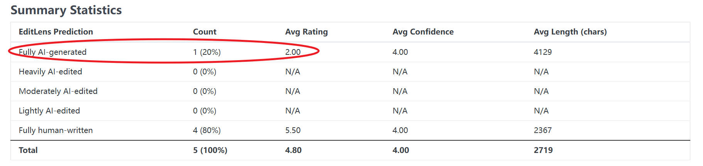

# Evidence of Policy Violation by Reviewer wNfJ
Paper: #6307

## 1. Summary

This report presents evidence that the review provided by Reviewer wNfJ (Score: 2) was **fully generated using an LLM**, violating ICLR's review policy. Our analysis includes a control group: the same detection tools correctly identified all other reviewers (WqcR, rGrB, CKa4, F3q3) as "Fully Human," eliminating the possibility that the paper's technical jargon triggered a false positive. The summary of detection results is shown in Table 1.

*Table 1: Summary of LLM detection result.*
| Reviewer | Rating | Pangram Labs | GPTZero |
| :--- | :---: | :--- | :--- |
| **wNfJ** | **2** | **Fully AI-generated** | **100% AI generated** |
| WqcR | 4 | Fully human-written | 100% Human |
| rGrB | 6 | Fully human-written | 100% Human |
| CKa4 | 6 | Fully human-written | 100% Human |
| F3q3 | 6 | Fully human-written | 100% Human |

## 2. Evidence

### 2a. Pangram Labs

Pangram Labs (https://www.pangram.com/) is a leading enterprise-grade detection solution trusted by global organizations and academic institutions. Notably, Pangram provides a specialized detection module for ICLR reviews (https://iclr.pangram.com), specifically calibrated to handle the technical density and formal tone of ICLR submissions.

As shown in Figure 1, the tool successfully filtered our submission's reviews. Only **Reviewer wNfJ** (Score: 2) was flagged as "**Fully AI-generated**" (Red). The table reveals a perfect correlation between the AI flag and the low quality: the AI-generated review corresponds to the outlier score of 2.00, whereas the verified human reviews maintain a high average rating of 5.50.

*Figure 1: Screen shot from Pangram Labs detection result for paper # 6307.*

Official report link: https://iclr.pangram.com/reviews?submission_number=6307

### 2b. GPTZero

GPTZero (https://gptzero.me/) is widely regarded as the "gold standard" for AI detection, used by educators and institutions worldwide. It utilizes perplexity and burstiness metrics to distinguish between human and machine writing patterns.

Figure 2 identifies **Reviewer wNfJ as the only "100% AI-generated."** In contrast, Figures 3, 4, 5, and 6 confirm that reviews from other reviewers were correctly identified as "100% Human." 

*Figure 2: GPTZero detection result (100% AI generated) for Reviewer wNfJ.*

*Figure 3: Control check: GPTZero detection result (100% Human) for Reviewer rGrB.*

*Figure 4: Control check: GPTZero detection result (100% Human) for Reviewer WqcR.*

*Figure 5: Control check: GPTZero detection result (99% Human) for Reviewer CKa4.*

*Figure 6: Control check: GPTZero detection result (100% Human) for Reviewer F3q3.*

